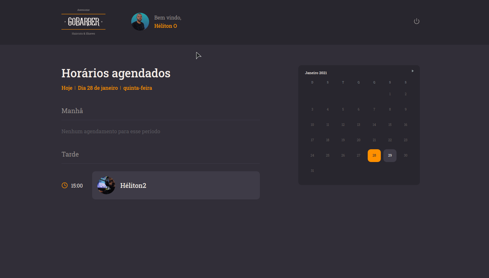

<h1 align="center">
  
</h1>

<p align="center">
  

  

  

  <a href="https://www.linkedin.com/in/helitonoliveira/">
    
  </a>

  <a href="https://github.com/helitonoliveiraa/gobarber2k20-web?/commits/master">
    
  </a>

  

  <a href="https://github.com/helitonoliveiraa/gobarber2k20-web/stargazers" >
    
  </a>
</p>

<p align="center">
  <a href="#rocket-about-the-project">About the project</a>&nbsp;&nbsp;&nbsp;|&nbsp;&nbsp;&nbsp;
   <a href="#wrench-functionality">Functionality</a>&nbsp;&nbsp;&nbsp;|&nbsp;&nbsp;&nbsp;
  <a href="#wrench-technologies">Technologies</a>&nbsp;&nbsp;&nbsp;|&nbsp;&nbsp;&nbsp;
  <a href="#memo-license">Licence</a>
</p>

<p align="center">
  

  
</p>

<p align="center">
  <a href="https://keen-goodall-822c5d.netlify.app/">
    
  </a>

  <br />

  <a href="https://www.youtube.com/watch?v=I4ptIFSG4Ps">
    
  </a>
</p>

# :rocket: About the project

This is the GoBarber web application that is an app for beauty scheduling that I developed during the Bootcamp gostack of Rocketseat.<br />
This web version is dedicated to the user provider of service and I developed the mobile version for the user client

To see the API, click here [GoBarber2k20-API](https://github.com/helitonoliveiraa/gobarber2k20-api)

To see the mobile app, click here [GoBarber2k20-mobile](https://github.com/helitonoliveiraa/gobarber2k20-mobile)

### Functionality

In this web version, the app has these functionalities;

<ul>
  <li>the user (provider of service) can;</li>
  <ul>
    <li>register in an application</li>
    <li>log in an application</li>
    <li>to see all your appointments of the day and the future</li>
    <li>to update your avatar</li>
    <li>to update your data like name, email and password</li>
    <li>log out</li>
  </ul>
</ul>

 🎨 totality responsive

## :wrench: Technologies

- [ReactJS](https://pt-br.reactjs.org/)
- [TypeScript](https://www.typescriptlang.org/)
- [Unform](https://unform.dev/)
- [Styled Components](https://styled-components.com/)
- [Polished](https://polished.js.org/)
- [react-day-picker](https://react-day-picker.js.org/)
- [framer-motion](https://www.framer.com/)
- [react-loader-spinner](https://www.npmjs.com/package/react-loader-spinner)
- [react-spring](https://www.react-spring.io/)
- [React-Icons](https://react-icons.github.io/react-icons/)
- [Yup](https://github.com/jquense/yup)
- [date-fns](https://date-fns.org/)
- [React Testing Library](https://testing-library.com/docs/react-testing-library/intro/)
- [Axios](https://github.com/axios/axios)

# :tada: Get started

⚠ `Have application's `[API](https://github.com/helitonoliveiraa/gobarber2k20-api) `running`

## Clone the project and access the folder

```bash
$ git clone https://github.com/helitonoliveiraa/gobarber2k20-web.git && cd gobarber2k20-web
```

## Follow the bellow steps

```bash
# install the dependencies
$ yarn / npm run install

# start the web client
$ yarn start / npm run start
```
# :memo: License

Esse projeto está sob a licença MIT. Veja o arquivo [LICENSE](https://github.com/helitonoliveiraa/gobarber2k20-web/blob/main/LICENSE) para mais detalhes.
